# ⚡ Zapier Clone

A full-stack automation platform inspired by [Zapier](https://zapier.com/).  
Create “Zaps” to connect apps, trigger workflows, and automate tasks — all from a sleek Next.js dashboard.


---

## ✨ Features

- **Create & Manage Zaps** – Trigger actions based on events
- **Folder Organization** – Group Zaps into folders and projects
- **Inline Rename** – Rename Zaps or folders without page reload
- **History & Versioning** – Track changes over time
- **Reusable Templates** – Create and share automation templates
- **Real-time UI** – Built with Recoil state management
- **Authentication** – Secure login with NextAuth
- **Prisma ORM** – Type-safe database access
- **Beautiful UI** – Tailwind CSS components & Lucide icons

---

## 📸 Demo

<p align="center">
  
</p>

---

## 🗂 ERD (Database Schema)

<p align="center">
  
</p>

## <!-- <video src""/> -->

## 🛠 Tech Stack

**Frontend**

- [Next.js](https://nextjs.org/) (App Router)
- [Recoil](https://recoiljs.org/) for state management
- [Tailwind CSS](https://tailwindcss.com/) for styling
- [Lucide Icons](https://lucide.dev/) for crisp SVG icons

**Backend**

- Node.js + Express
- Prisma ORM
- PostgreSQL
- REST API + Axios calls
- NextAuth for authentication

---

## 🚀 Getting Started

### 1️⃣ Clone the repo

```bash
git clone https://github.com/yourusername/zapier-clone.git
cd zapier-clone
```
